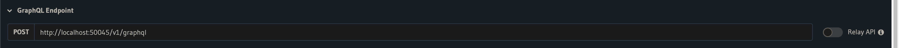

# Test Suite

This folder contains all tests for the project. 

## Requirements
1. Install SDK
    ```bash
    cd superai-sdk-private
    pip install -e .
    # For setting environment
    pip install canotic
    ```
2. Login and set environment
    ```bash
    superai login -u <email-id>
    canotic config set dev
    ```
3. Clone [meta-ai](https://github.com/mysuperai/meta-ai) repository

## Running meta-ai locally

For spawning a local database of [meta-ai](https://github.com/mysuperai/meta-ai) repository, go to your local copy of the meta-ai repository and start hasura in local mode. You might have to export `AWS_ACCESS_KEY_ID` and `AWS_SECRET_ACCESS_KEY` for the chalice installation. You can get that from `cat ~/.aws/credentials`

```bash
cd meta-ai
cd hasura
export AWS_ACCESS_KEY_ID=<access_key>
export AWS_SECRET_ACCESS_KEY=<secret_key>
./start_local_console.sh
```
> You might have to make it executable by `chmod +x start_local_console.sh`

Once the dashboard opens (link will be shown in the previous step), obtain the GraphQL Endpoint from the UI



Change the endpoint in the [superai.apis.meta_ai.session](../superai/apis/meta_ai/session.py) file (L14-15).

Now all your endpoint requests will be pointed to your local installation of meta-ai. This is recommended for running the tests in [`test_meta_ai.py`](./apis/test_meta_ai.py) and [`mocked_test_ai.py`](./meta_ai/mocked_test_ai.py). 

> [`mocked_test_ai.py`](./meta_ai/mocked_test_ai.py) does not run in the Jenkins test suite. You can manually run it using Pytest or in Pycharm.
